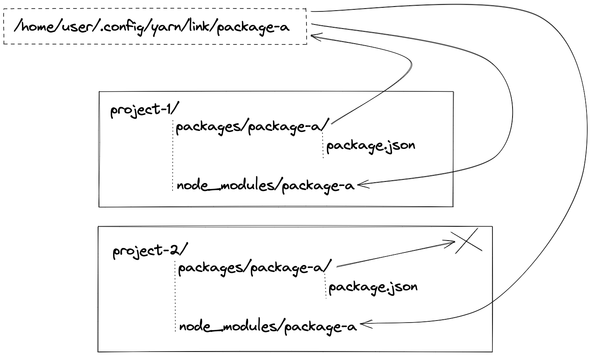

# resolve-symlinks

## Usage

```bash
npx resolve-symlinks
```

## Why this exists

When you install package using npm/yarn locally (`npm i ./path/to/package`) it actually links your package to **.config/yarn/link/\<package-name>** first, and only then to your **node_modules** folder.

So, if you have 2 folders with locally installed packages with the same name in **package.json**, the first package you install will be linked to global directory, second one will use link from first package.

The following diagram might help understanding the situation:



Because of that your dev-servers might not work as expected (reload on safe) since your are saving files in one project, while the package is actually linked to other directory.

## How it works

The whole source code is about 200 lines of code, when it runs it does the following things:  
1. Checks if **package.json** even exists. Exits if it does not.
2. Loads data from **package.json**. Checks if **dependencies** field exists and is of type **object**. Exits if it is not.
3. Checks if **node_modules** exists. If they do not exist, runs a prompt to install dependencies using `npm i` command. (can be changed later)
4. Filters dependencies to process only locally installed ones.
5. Checks if packages exists. If they do not, exits.
6. Checks if packages exists in **node_modules** folder. If they do not, exits.
7. Loads real paths of locally installed dependencies.
8. Filters dependencies to process only those which are installed from incorrect path. Aka, the whole idea of this package.
9. If there are any, logs them in the console and prompts to fix them.  
If you want to fix them, this package will do the following:  
\1. Unlink package from **./config/yarn/link/\<package-name>**.  
\2. Unlink package from **node_modules**.  
\3. Link package into **./config/yarn/link/\<package-name>**  
\4. Link global package into **node_modules/\<package-name>**  
If not, will end the process.

That is it.
